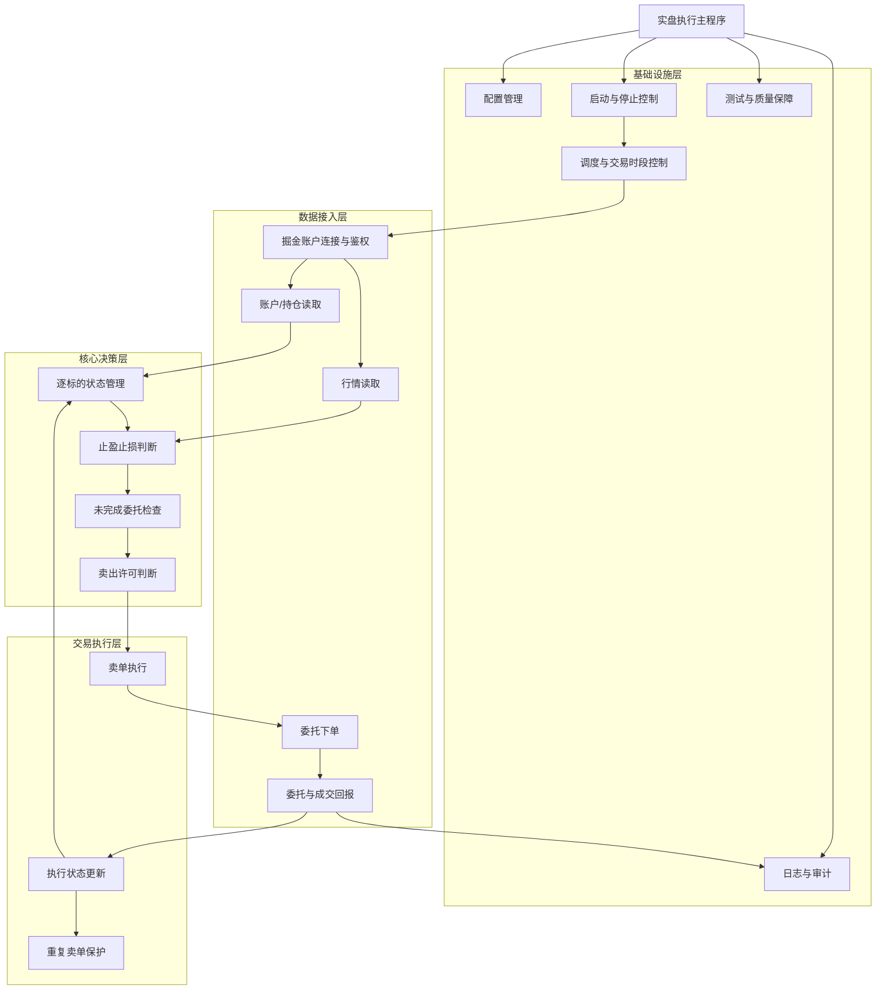

# 东方财富掘金实盘执行系统规划书（第一期）

## 文档定位

这是一份面向个人或小团队的第一期实盘执行系统规划书，目标是在东方财富掘金仿真环境中尽快跑通一个最小、可验证、可审计的自动卖出闭环。

本期文档不再讨论研究平台、前端页面、回测引擎、历史数据底座、多数据源采集和远期路线，而是聚焦于真实交易链路最关键的几件事：

- 连接掘金仿真账户
- 读取账户资金与全部持仓
- 自动识别可卖持仓
- 按固定止盈止损规则触发卖出
- 接收委托与成交回报
- 防止重复卖单
- 保留完整日志与错误审计

## 首期已确认前提

- 交易环境：东方财富掘金仿真账户
- 交易接口：行情、账户、持仓、委托、回报全部统一走东方财富掘金官方接口
- 开发语言：Python 3.10+
- 策略范围：固定止盈止损自动卖出
- 交易范围：自动识别账户当前全部可卖持仓
- 交易方向：只做自动卖出，不做自动买入
- 建仓方式：默认由人工先建仓，系统不负责开仓
- 运行方式：单进程常驻策略程序

## 第一阶段成功标准

在东方财富掘金仿真环境中，系统能够自动识别账户当前全部可卖持仓，并对满足固定止盈止损条件的标的执行自动卖出；同时，每个标的都具备独立状态管理、重复卖出防护和可审计日志。

---

## 一、项目定位与边界

### 1.1 第一阶段目标

第一阶段不是做完整交易平台，而是先把最关键的自动交易闭环跑通。系统需要证明以下能力已经稳定成立：

- 掘金账户可连接
- 掘金持仓可读取
- 行情可获取
- 止盈止损规则可判断
- 卖单可发出
- 委托和成交回报可接收
- 同一标的不会重复发单
- 错误不会静默失败

### 1.2 第一阶段范围

第一阶段只做以下内容：

- 掘金仿真账户登录与鉴权
- 账户资金与全部持仓查询
- 可卖持仓筛选
- 逐标的止盈止损判断
- 自动卖出委托
- 委托状态与成交回报跟踪
- 交易时段控制
- 本地日志与审计记录

### 1.3 非目标范围

第一阶段明确不做以下内容：

- 前端页面
- 回测功能
- 自动买入
- 多账户支持
- 对外 Web API
- 数据库主链路
- 多策略组合
- 任意 Python 策略上传
- 第二期和远期规划内容

### 1.4 设计原则

本期系统坚持以下三个原则：

1. 正确性优先  
   先保证交易动作和状态判断正确，再追求速度和扩展性。

2. 可维护性第二  
   第一版可以小，但边界要清楚，避免后续新增买入、风控或多账户时必须推翻重写。

3. 可观测性第三  
   每次判断、每次触发、每次委托、每次异常都要留下日志和上下文，不能黑箱运行。

---

## 二、总体技术方案

### 2.1 技术基线总览

| 维度 | 第一阶段方案 | 说明 |
| --- | --- | --- |
| 开发语言 | Python 3.10+ | 与掘金官方 Python 接口配合更直接，试错成本低 |
| 行情接口 | 东方财富掘金官方接口 | 不混用其他数据源 |
| 交易接口 | 东方财富掘金官方接口 | 委托、回报、账户查询统一口径 |
| 执行环境 | 掘金仿真账户 | 用于验证最小闭环，不直接上实盘 |
| 运行形态 | 单进程常驻策略程序 | 降低第一版复杂度 |
| 调度方式 | 定时检查 + 实时回报结合 | 兼顾状态轮询与订单回报 |
| 配置方式 | 本地配置文件 | 只保留最小必要配置 |
| 观测方式 | 本地日志 + 掘金回报 | 第一版不建设前端和数据库 |

### 2.2 为什么第一期继续用 Python

第一期目标是尽快跑通掘金仿真环境下的最小自动交易闭环，而不是追求极低延迟。因此，Python 是更稳妥的选择。

原因有三点：

- 掘金官方文档和 Python 接入路径更直接，试错成本更低。
- 第一版核心是状态判断、规则执行、日志审计和委托回报处理，属于业务编排问题，不是极致性能问题。
- 后续即使增加自动买入、简单风控和配置管理，Python 仍然足够支撑。

### 2.3 运行方式

第一阶段采用单进程常驻策略程序运行，不额外建设前端服务、HTTP 接口或数据库服务。

程序启动后执行以下循环：

- 初始化掘金连接
- 获取账户和持仓
- 逐标的执行判断
- 触发卖单
- 等待并处理回报
- 继续轮询直到程序停止

第一版优先保证逻辑闭环清楚，不追求复杂部署和多节点调度。

### 2.4 配置边界

第一阶段只保留最小必要配置，避免过度抽象。建议配置项包括：

- 掘金鉴权信息
- 账户标识
- 轮询间隔
- 止盈比例
- 止损比例
- 允许交易的时间窗口
- 日志目录

为防止复杂度膨胀，第一期默认全账户所有持仓共用一套止盈止损参数，不做按标的独立参数编排。

---

## 三、系统架构设计

### 3.1 架构目标

第一阶段架构重点不是“模块越多越好”，而是“职责边界清楚、后续可扩”。因此，系统不再按流程口径拆层，而是按职责固定为四层：

- 基础设施层
- 数据接入层
- 核心决策层
- 交易执行层

这种分法的目的很直接：

- 把运行控制、日志和测试沉到基础设施层
- 把所有掘金接口交互收敛到数据接入层
- 把策略判断和状态判断放到核心决策层
- 把真实卖单动作和回报跟踪放到交易执行层

### 3.2 四层职责

| 分层 | 核心职责 | 关键输出 |
| --- | --- | --- |
| 基础设施层 | 配置管理、启动停止、调度控制、交易时段控制、日志审计、测试与质量保障 | 程序运行能力、日志、测试结果 |
| 数据接入层 | 掘金账户登录、资金读取、持仓读取、行情读取、委托下单、委托与成交回报接收 | 账户数据、持仓数据、行情数据、订单原始结果 |
| 核心决策层 | 逐标的状态管理、止盈止损判断、未完成委托检查、卖出许可判断 | 卖出信号、触发原因、逐标的决策状态 |
| 交易执行层 | 接收卖出信号、执行卖单、跟踪委托状态、更新执行结果、防重复卖单 | 委托结果、成交状态、执行结果快照 |

### 3.3 系统架构图

### 3.4 分层约束

为了保证第一期架构不会失控，必须遵守以下约束：

- 所有对掘金的调用都统一经过数据接入层
- 核心决策层只做“该不该卖”的判断，不直接发单
- 交易执行层只负责“怎么卖”和“卖完后状态怎么收口”
- 基础设施层必须覆盖测试与质量保障，不能只管日志和调度
- 逐标的状态必须作为核心决策层的一部分独立维护，禁止用全局布尔状态替代

---

## 四、核心运行链路

### 4.1 主链路

第一阶段主链路定义如下：

1. 程序启动，加载配置并初始化日志。
2. 基础设施层判断当前运行环境与交易时段是否合法。
3. 数据接入层连接东方财富掘金仿真账户，确认账户可用。
4. 数据接入层获取账户资金与当前全部持仓。
5. 核心决策层过滤出可卖数量大于零的持仓标的，并为每个标的建立或更新状态。
6. 数据接入层获取相关标的最新行情。
7. 核心决策层基于持仓成本、当前价格、止盈比例和止损比例判断是否触发卖出。
8. 核心决策层检查该标的当前是否存在未完成卖单，以及当前是否满足交易时段约束。
9. 若不允许卖出，则记录本轮检查结果并进入下一轮。
10. 若允许卖出，则交易执行层发起卖单，并记录触发原因、价格与委托结果。
11. 数据接入层接收委托与成交回报，交易执行层更新该标的执行状态。
12. 若某标的卖出完成，则更新为完成状态；若失败或异常，则进入明确的异常状态并留痕。
13. 程序继续轮询全部持仓，直到程序停止。

### 4.2 逐标的状态模型

第一阶段必须按标的维护独立状态。建议状态如下：

| 状态 | 含义 |
| --- | --- |
| `idle` | 有持仓，但本轮未触发卖出 |
| `triggered` | 已满足止盈或止损条件，待进入执行层 |
| `submitting` | 正在发起卖单 |
| `submitted` | 卖单已发出，等待回报 |
| `partially_filled` | 部分成交 |
| `filled` | 已全部成交 |
| `cancelled` | 委托已撤 |
| `failed` | 委托失败或状态异常，需要人工关注 |

这些状态必须以“标的代码”为粒度管理，不能使用单一全局布尔值代替。

### 4.3 决策输入与输出

第一阶段的核心决策口径固定且简单：

- 止盈条件：当前价格达到或超过持仓成本的止盈阈值
- 止损条件：当前价格低于或等于持仓成本的止损阈值

决策输入包括：

- 标的代码
- 持仓成本
- 当前价格
- 可卖数量
- 止盈比例
- 止损比例
- 当前逐标的状态
- 当前是否处于允许交易时间

决策输出包括：

- 是否触发
- 触发类型：止盈或止损
- 触发价格
- 对应阈值
- 是否允许进入交易执行层

### 4.4 交易时段与防重复卖出

第一阶段最关键的运行约束有两个：交易时段控制和防重复卖单。

系统必须保证：

- 非交易时段允许启动和读取状态，但不允许发起新卖单
- 交易时段内才允许核心决策层把信号送入交易执行层
- 同一标的若已有未完成卖单，禁止再次主动发单
- 某标的已处于 `submitted` 或 `partially_filled` 状态时，后续轮询只能跟踪状态，不能重复提交
- 不同标的互不影响，一个标的的状态不能覆盖另一个标的
- 程序重启后，应至少根据账户持仓和未完成委托恢复基本判断能力

---

## 五、模块设计说明

### 5.1 配置与启动模块

**职责**

- 读取本地配置
- 初始化日志
- 启动主程序
- 控制程序退出

**设计要求**

- 配置项保持最小必要集合
- 启动失败必须输出明确错误信息
- 不允许静默降级为未知状态

### 5.2 数据接入模块

**职责**

- 初始化掘金环境
- 执行账户鉴权
- 获取账户资金
- 获取当前持仓
- 获取标的行情
- 发起卖单
- 接收委托与成交回报

**设计要求**

- 统一封装外部接口调用，业务层不直接处理 SDK 原始结构
- 所有接口错误必须带上下文记录
- 对外返回统一的内部数据结构，降低业务层耦合

### 5.3 持仓状态模块

**职责**

- 维护账户全部持仓快照
- 识别哪些标的具备可卖数量
- 为每个标的维护独立状态
- 保存本轮是否已触发卖出

**设计要求**

- 必须按标的隔离状态
- 必须允许从账户数据与委托数据恢复当前状态
- 不依赖数据库也要保留最小状态一致性

### 5.4 核心决策模块

**职责**

- 基于固定止盈止损规则计算是否应卖出
- 检查当前交易时段是否允许卖出
- 检查是否已有未完成委托
- 输出明确触发原因与决策结果

**设计要求**

- 只做判断，不直接发单
- 每次判断都必须可审计
- 第一版不扩展为策略工厂或脚本加载器

### 5.5 交易执行模块

**职责**

- 接收核心决策层输出
- 检查该标的当前是否允许下单
- 发起卖出委托
- 跟踪委托状态和成交回报
- 更新逐标的执行结果

**设计要求**

- 下单前必须检查重复卖单风险
- 委托失败必须明确标记为失败状态并落日志
- 已发单后必须只跟踪状态，不能重复触发

### 5.6 日志与审计模块

**职责**

- 记录运行日志
- 记录交易触发日志
- 记录委托与成交日志
- 记录错误与异常日志

**设计要求**

- 不允许异常静默吞掉
- 日志必须可回溯“为什么卖、何时卖、卖了多少、结果怎样”
- 若发生严重异常，程序退出前必须留下可定位信息

---

## 六、测试与质量保障

### 6.1 设计目标

第一阶段虽然范围收敛，但测试不能缺席。否则系统会出现“代码能运行，但不知道何时会重复卖出、误卖出或在非交易时段下单”的问题。

因此，测试与质量保障必须作为独立章节，而不是附属于基础设施层的一句说明。

### 6.2 单元测试范围

第一阶段至少覆盖以下单元测试：

- 止盈判断是否正确
- 止损判断是否正确
- 交易时段判断是否正确
- 同一标的已有未完成卖单时是否禁止重复卖出
- 不同标的状态是否互相隔离

### 6.3 集成测试范围

第一阶段至少覆盖以下集成测试：

- 持仓读取结果能否正确转换为逐标的状态
- 行情输入是否能驱动核心决策层输出卖出信号
- 卖出信号进入交易执行层后，状态是否正确更新
- 回报输入后，状态是否能从 `submitted` 进入 `filled`、`cancelled` 或 `failed`

### 6.4 仿真冒烟验证

第一阶段必须保留仿真环境冒烟验证，用于确认真实链路没有在接口层断掉。冒烟重点包括：

- 账户可连接
- 当前持仓可读取
- 有持仓但未触发时不会误下单
- 触发卖出时能成功发单
- 委托和成交回报能被接收和记录

### 6.5 质量门槛

第一阶段文档和实现都应当以以下标准作为最低质量门槛：

- 无持仓时不发单
- 非交易时段不发单
- 同一标的不重复发单
- 失败有日志
- 回报异常有日志
- 核心判断口径可通过测试复现

---

## 七、日志与审计要求

### 7.1 日志分类

第一阶段至少区分以下日志：

- 运行日志：程序启动、停止、轮询、状态切换
- 交易日志：触发条件、发单动作、委托编号、成交状态
- 错误日志：接口失败、状态异常、回报异常、委托失败

### 7.2 日志字段

每次关键动作至少记录以下字段：

| 字段 | 说明 |
| --- | --- |
| 时间 | 事件发生时间 |
| 标的代码 | 当前处理的标的 |
| 当前价格 | 用于触发判断的价格 |
| 持仓数量 | 当前可卖数量 |
| 持仓成本 | 当前持仓均价或成本基准 |
| 止盈阈值 | 当前止盈判断口径 |
| 止损阈值 | 当前止损判断口径 |
| 触发原因 | 止盈或止损 |
| 委托结果 | 发单成功、失败或拒绝 |
| 成交状态 | 已报、部成、已成、已撤等 |
| 错误原因 | 若失败或异常时的上下文 |

### 7.3 审计要求

第一阶段虽然不建设数据库主链路，但仍必须满足最小审计要求：

- 能回看每次卖出触发的原因
- 能追踪每个标的的状态流转
- 能确认某次委托失败的具体原因
- 能区分“未触发”、“已触发但未发单”和“已发单待回报”

---

## 八、里程碑设计

### 8.1 M0：环境与账户连通

**阶段目标**

- 跑通掘金仿真环境接入

**完成定义**

- 能完成账户鉴权
- 能获取账户资金
- 能读取当前全部持仓
- 能获取持仓标的行情

### 8.2 M1：数据接入跑通

**阶段目标**

- 稳定打通掘金接口的数据读取和委托调用能力

**完成定义**

- 账户、持仓、行情读取路径稳定
- 委托提交接口可调用
- 委托回报和成交回报可接收

### 8.3 M2：核心决策与状态管理

**阶段目标**

- 建立多标的持仓识别、逐标的状态管理和规则判断能力

**完成定义**

- 能识别全部可卖持仓
- 每个标的都有独立状态
- 能完成止盈止损和交易时段判断
- 能识别未完成卖单并阻止重复触发

### 8.4 M3：自动卖出执行闭环

**阶段目标**

- 跑通从触发到发单再到回报处理的完整闭环

**完成定义**

- 满足条件的标的能够自动卖出
- 能接收并记录委托状态与成交回报
- 同一标的不会重复发单
- 多标的之间状态不会互相污染

### 8.5 M4：测试、日志与稳定运行

**阶段目标**

- 提升程序稳定性和可运维性

**完成定义**

- 单元测试、集成测试和仿真冒烟验证具备最小覆盖
- 交易时段控制生效
- 接口异常、下单失败、回报异常均能落日志
- 严重错误不会静默失败
- 程序可以连续运行并保留最小可运维能力

---

## 九、关键风险与运行约束

### 9.1 仿真与真实交易差异

掘金仿真能验证交易流程，但不等于真实成交结果。第一阶段验证的是链路正确性，不把仿真成交当作真实收益依据。

### 9.2 重复卖单风险

第一阶段最需要重点防的就是重复卖单。若同一标的已有未完成卖单，系统必须禁止再次主动发单。

### 9.3 多标的状态串扰风险

多个标的同时存在持仓时，系统必须按标的隔离状态。一个标的的委托状态变化，不能覆盖另一个标的的运行状态。

### 9.4 行情、账户与回报异常风险

若行情获取失败、账户读取失败、委托回报延迟或异常，系统必须进入明确状态并记录日志，不能继续按成功路径假设执行。

### 9.5 交易时段风险

系统必须只在允许的交易时间窗口内发单。盘前、盘后、非交易日和异常停牌期间都要避免误动作。

### 9.6 自动买入缺失的边界

第一阶段只做自动卖出，因此系统默认依赖人工先建仓。若账户没有持仓，系统不应自行开仓，也不应虚构目标仓位。

### 9.7 非目标约束

为了避免第一版范围扩散，以下内容必须明确排除：

- 前端
- 回测
- 自动买入
- 多账户
- 数据库主链路
- 对外接口服务
- 复杂风控
- 策略工厂和动态脚本执行

---

## 十、技术选型结论

第一阶段的技术路线必须保持克制：

- 用 Python，而不是双语言并行
- 用东方财富掘金官方接口，而不是混用多家数据与交易源
- 用单进程常驻程序，而不是一开始就做分布式调度
- 用四层职责架构，而不是把判断、下单和运行控制写成一团
- 用日志、测试和订单回报做观测，而不是先建完整平台

这套方案的核心优势不是“功能全”，而是“链路短、目标清晰、风险可控、容易尽快跑通”。只要第一阶段能稳定实现多标的自动卖出闭环，并具备最小测试和审计能力，这份规划书的目标就已经达成。

## 下一步建议

这份文档完成后，后续最合理的顺序是：

1. 先产出实施计划，明确文件结构、配置方式、状态模型与验证命令。
2. 再进入代码实现，优先打通仿真账户连通、持仓读取、决策判断和卖单闭环。
3. 等第一阶段跑稳后，再决定是否在第二阶段引入自动买入、数据库或多账户扩展。
